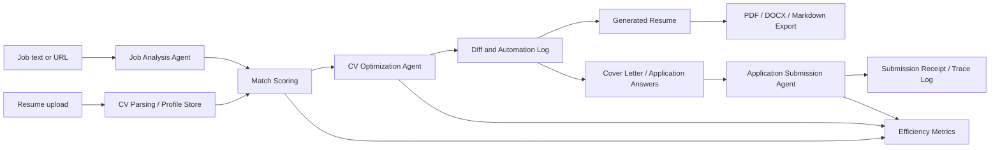

# Quick-Career Architecture

Quick-Career, is ilanlarini analiz eden, aday CV'sini hedef ilana gore otonom optimize eden, final cikti ureten ve basvuru surecini kullanici onayi beklemeden otomatiklestiren FastAPI + React tabanli bir hackathon MVP'sidir. Projenin ana basari kriteri, is arama ve basvuru hazirligi icin tekrar eden manuel adimlari en az `%50` azaltmaktir.

Bu belge SolveX AI Hackathon 2026 teknik sartnamesindeki Plan Agent ciktisidir. Gelistirme boyunca `ROADMAP.md`, GitHub Issues, PR aciklamalari ve kod yorumlari ile izlenebilirlik saglanir.

## Goals

- Is ilanindan rol, seviye, yetkinlik, anahtar kelime, sorumluluk ve eleme kriterlerini cikarmak.
- CV'yi parse ederek aday profili, deneyim, beceri, proje ve olculebilir basari alanlarini standart modele donusturmek.
- Ilan ile CV arasindaki uyumu skorlamak ve eksikleri aciklamak.
- Otonom optimizasyon ile CV'yi hedef ilana gore yeniden yazmak, farklari kaydetmek ve final ciktiyi otomatik uretmek.
- Optimize edilmis CV ve basvuru metni ile tam otomatik basvuru gonderimi akisini desteklemek.
- Manuel sure, tiklama sayisi ve tekrar eden kopyala/yapistir adimlarini olcerek `%50+` is azaltimini gostermek.

## Non-Goals For MVP

- Tum kariyer platformlarinda genel amacli scraping yapmak.
- Kullanicidan her adimda manuel onay bekleyen yari-otomatik basvuru akisi kurmak.
- Basvuru platformlarinin kullanim sartlarini asan veya kullanici kimligi disinda islem yapan gizli otomasyonlar kurmak.
- Kurumsal ATS entegrasyonlarini MVP'nin zorunlu parcasi yapmak.

## Product Workflow



Ana akis:

1. Kullanici ilan metni girer veya ilan URL'si ekler.
2. Backend ilan metnini normalize eder ve `Job Analysis Agent` ile rol, beceri, deneyim, anahtar kelime ve eleme kriterlerini cikarir.
3. Kullanici CV yukler; `CV Parsing / Profile Store` CV'yi yapilandirilmis `ResumeProfile` modeline cevirir.
4. `Match Scoring` ilana gore beceri eslesmesi, eksik kriterler ve guclu alanlari skorlar.
5. `CV Optimization Agent` CV ozetini, deneyim maddelerini, beceri siralamasini ve proje vurgularini hedef ilana gore yeniden yazar.
6. Frontend kullaniciya satir/saha bazli fark ve otomasyon log ekranini sunar.
7. Sistem degisiklikleri otonom olarak final hale getirir.
8. Sistem PDF, DOCX ve Markdown cikti uretir.
9. `Application Submission Agent` form/email/platform adapter'i ile basvuruyu otomatik gonderir.
10. `AITraceLog` ve `EfficiencyMetric` kayitlari demo dashboard'unda gosterilir.

## Technology Stack

| Layer | Choice | Purpose |
| --- | --- | --- |
| Backend API | Python FastAPI | REST API, validation, orchestration |
| Schemas | Pydantic | Request/response contracts and AI output validation |
| Database | PostgreSQL | Persistent job, resume, optimization and trace data |
| ORM | SQLAlchemy | Domain model mapping |
| Migrations | Alembic | Versioned schema changes |
| Cache / Jobs | Redis optional | Background optimization, export and submission queues |
| Frontend | React + TypeScript + Vite | MVP web app and demo UI |
| State | TanStack Query or equivalent | Server-state, retries, loading/error states |
| Styling | Existing design system or lightweight CSS modules | Focused product UI |
| AI Layer | Provider-agnostic adapters | OpenAI, Anthropic, local model or mock provider |
| Export | Backend document service | PDF, DOCX and Markdown generation |

## Backend Architecture

Recommended package layout:

```text
backend/
  app/
    api/
      routes/
        jobs.py
        resumes.py
        optimizations.py
        applications.py
        metrics.py
    core/
      config.py
      security.py
      logging.py
    db/
      models.py
      session.py
      migrations/
    schemas/
      job.py
      resume.py
      optimization.py
      application.py
      metrics.py
    services/
      ai/
        base.py
        mock_provider.py
        openai_provider.py
        anthropic_provider.py
      job_analysis.py
      resume_parser.py
      match_scoring.py
      cv_optimizer.py
      document_export.py
      application_submission.py
      traceability.py
      efficiency_metrics.py
    tests/
```

### Core Services

| Service | Responsibility |
| --- | --- |
| `JobAnalysisService` | Converts raw job text or URL content into structured requirements. |
| `ResumeParserService` | Extracts candidate profile data from uploaded CV files or pasted text. |
| `MatchScoringService` | Scores job-resume fit and produces explainable gaps. |
| `CVOptimizerService` | Produces targeted resume edits, rewritten bullets and keyword alignment. |
| `DocumentExportService` | Generates PDF, DOCX and Markdown outputs after autonomous optimization. |
| `ApplicationSubmissionService` | Submits optimized application packages through adapters. |
| `AITraceabilityService` | Records prompt purpose, provider, model, input hashes and output summary. |
| `EfficiencyMetricsService` | Calculates manual-vs-automated effort reduction. |

### AI Provider Abstraction

All AI calls go through a provider interface so the project can switch between OpenAI, Anthropic, local models or mocks without changing business services.

```python
class AIProvider:
    async def generate_json(
        self,
        *,
        task: str,
        system_prompt: str,
        user_payload: dict,
        schema_name: str,
    ) -> dict:
        ...
```

Rules:

- Business services never call vendor SDKs directly.
- Every AI response is validated with Pydantic before persistence.
- Each call creates an `AITraceLog` entry.
- Mock provider is mandatory for tests and demo fallback.
- Provider errors return retryable API states, not partial final CV files.

## Frontend Architecture

Recommended layout:

```text
frontend/
  src/
    api/
      client.ts
      jobs.ts
      resumes.ts
      optimizations.ts
      applications.ts
      metrics.ts
    features/
      job-analysis/
      resume-upload/
      match-score/
      optimization-review/
      application-submit/
      metrics-dashboard/
    components/
    routes/
    types/
```

### Main Views

| View | Purpose |
| --- | --- |
| Job Intake | Paste job text or submit URL. Shows extracted role, level, skills and keywords. |
| Resume Intake | Upload CV or paste resume text. Shows parsed profile quality warnings. |
| Match Report | Displays score, missing requirements, strong matches and suggested priorities. |
| Optimization Review | Shows AI-applied CV changes and automation trace details. |
| Export Center | Downloads optimized CV as PDF, DOCX or Markdown. |
| Application Submit | Confirms final package and triggers automatic submission adapter. |
| Efficiency Dashboard | Shows time, steps and repetitive work reduction against baseline. |

Frontend requirements:

- Long job descriptions and CV sections must wrap cleanly without overlapping.
- Every AI-running state needs loading, retry and failure UI.
- Optimization changes must be inspectable after autonomous generation.
- Application submission must show the exact target, payload summary and final confirmation.
- Demo mode can use deterministic mock data for reliable judging.

## Domain Data Model

| Entity | Key Fields | Notes |
| --- | --- | --- |
| `JobPost` | `id`, `source_type`, `source_url`, `raw_text`, `company`, `title`, `created_at` | Stores original job input. |
| `JobAnalysis` | `job_post_id`, `role`, `seniority`, `required_skills`, `preferred_skills`, `keywords`, `responsibilities`, `red_flags` | AI-generated structured analysis. |
| `ResumeProfile` | `id`, `owner_name`, `raw_text`, `summary`, `experiences`, `education`, `skills`, `projects`, `languages` | Parsed candidate profile. |
| `OptimizationRun` | `id`, `job_post_id`, `resume_profile_id`, `status`, `match_score_before`, `match_score_after`, `completed_at` | Tracks one autonomous optimization attempt. |
| `GeneratedResume` | `optimization_run_id`, `format`, `content`, `file_url`, `version`, `is_final` | Final output is created automatically after optimization. |
| `ApplicationSubmission` | `optimization_run_id`, `target`, `status`, `submitted_at`, `receipt`, `error_message` | Records automatic submission attempts. |
| `AITraceLog` | `agent_type`, `provider`, `model`, `prompt_version`, `input_hash`, `output_hash`, `summary`, `created_at` | Supports hackathon traceability. |
| `EfficiencyMetric` | `workflow_name`, `manual_steps`, `automated_steps`, `manual_minutes`, `automated_minutes`, `reduction_percent` | Proves `%50+` reduction. |

## Public API Contract

| Method | Endpoint | Purpose |
| --- | --- | --- |
| `POST` | `/api/jobs/analyze` | Analyze a job post from pasted text or URL. |
| `GET` | `/api/jobs/{id}` | Fetch job and analysis details. |
| `POST` | `/api/resumes/upload` | Upload or paste CV content and parse profile. |
| `GET` | `/api/resumes/{id}` | Fetch parsed resume profile. |
| `POST` | `/api/resumes/{id}/optimize` | Start optimization for a selected job. |
| `GET` | `/api/optimizations/{id}` | Fetch optimization status and scores. |
| `GET` | `/api/optimizations/{id}/diff` | Fetch proposed CV changes for review. |
| `POST` | `/api/optimizations/{id}/finalize` | Finalize autonomous changes and generate final outputs. |
| `POST` | `/api/optimizations/{id}/export` | Generate or refresh PDF, DOCX or Markdown output. |
| `POST` | `/api/applications/submit` | Submit an optimized application package. |
| `GET` | `/api/applications/{id}` | Fetch submission status and receipt. |
| `GET` | `/api/metrics/efficiency` | Return manual-vs-automated reduction metrics. |
| `GET` | `/api/trace/{optimization_run_id}` | Show AI traceability records for demo/review. |

## Autonomous Automation Policy

Quick-Career uses autonomous execution with traceable safety controls:

1. CV finalization: AI optimizes the CV and creates final export files without waiting for manual approval.
2. Application submission: the system submits the generated package automatically through the configured adapter.
3. Traceability: every autonomous step records inputs, outputs, status and provider metadata through `AITraceLog`.

This maximizes repetitive-work reduction while keeping the automation observable, testable and reversible through logs and generated artifacts.

## Security, Privacy And Compliance

- CV files contain personal data; store only necessary fields and avoid logging raw documents.
- Store uploaded files in a controlled object/file storage path with generated IDs.
- Hash AI inputs and outputs for traceability instead of exposing full private text in logs.
- Secrets such as AI API keys and email credentials must live in environment variables.
- Application submission adapters must respect platform limits and rate limits.
- Demo mode should prefer sandbox, email draft or mock submission adapter unless a target platform adapter is explicitly configured.

## Efficiency Measurement

The dashboard compares a manual baseline with the AI-assisted flow.

| Workflow | Manual Baseline | Automated Target |
| --- | --- | --- |
| Read and summarize job post | 10 minutes / 8 steps | 1 minute / 1 step |
| Identify missing CV keywords | 15 minutes / 10 steps | 2 minutes / 2 steps |
| Rewrite CV bullets | 30 minutes / 20 steps | 8 minutes / review-only |
| Prepare cover letter / answers | 20 minutes / 12 steps | 2 minutes / autonomous generation |
| Submit application package | 10 minutes / 8 steps | 2 minutes / confirmation-only |

Formula:

```text
reduction_percent = ((manual_effort - automated_effort) / manual_effort) * 100
```

Acceptance target:

- Overall reduction must be at least `%50`.
- Demo target should show `%70+` reduction for the golden path.
- Metrics should include both time and step count so the result is explainable.

## AI Traceability Standard

Every AI-assisted feature should be traceable in one of these places:

- `AITraceLog` record for runtime calls.
- PR description with `Plan Agent` or `Skills Agent` note.
- Code comment for complex algorithmic, security or database optimization decisions.

Example PR note:

```text
AI Traceability:
- Plan Agent: ARCHITECTURE.md module boundaries and sprint tasks.
- Skills Agent: Match scoring prompt/schema validation reviewed for deterministic tests.
```

## Deployment Shape

MVP deployment can use:

- `frontend`: Vite static build served by a simple web host.
- `backend`: FastAPI served by Uvicorn/Gunicorn.
- `postgres`: managed PostgreSQL or local container.
- `redis`: optional for background jobs; direct async execution is acceptable for early MVP.

Minimum environment variables:

```text
DATABASE_URL=
AI_PROVIDER=mock|openai|anthropic|local
AI_API_KEY=
EXPORT_STORAGE_PATH=
APPLICATION_SUBMISSION_MODE=mock|email|platform
```

## Definition Of Done

- Job analysis, resume parsing, CV optimization, autonomous export, application submission and metrics are represented in API contracts.
- React views cover the full demo path.
- Mock AI provider enables tests without paid API calls.
- Metrics prove `%50+` repetitive work reduction.
- AI traceability is documented for Plan Agent and Skills Agent usage.
- Final review includes refactoring and optimization pass before delivery.
